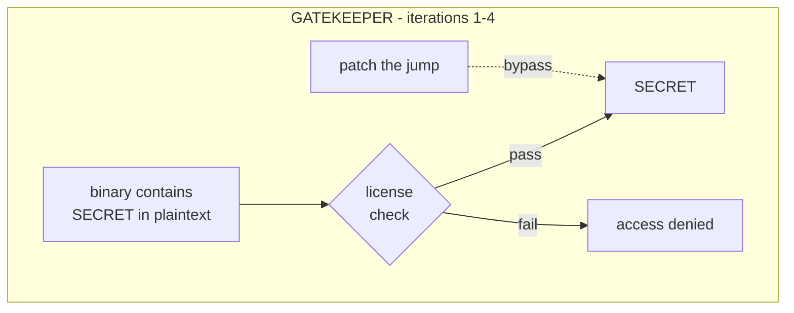
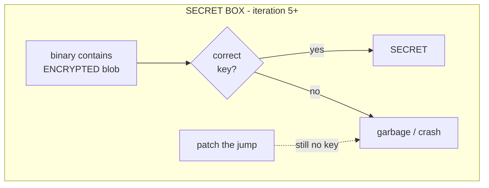
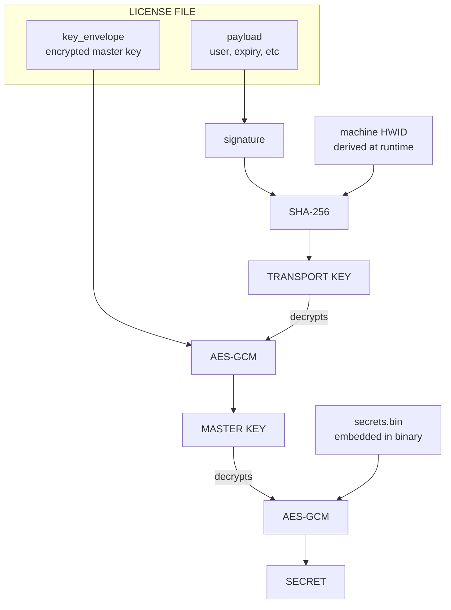
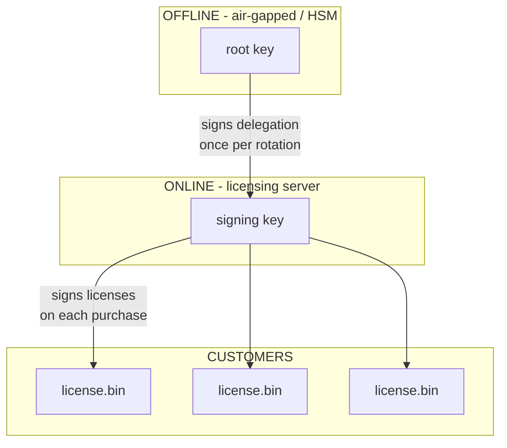

+++
title = "Building a Licensing System"
description = ""
date = 2026-02-02

[extra]
lang = "en"
toc = true
comment = false
math = false
mermaid = true
+++

In this document, we explore the idea of building a licensing system from the first principles. I'm purposefully not elaborating any properties of a robust licensing system upfront. The document iteratively explores them as we build and break each attempt.

# Where Things Start: An application

Let's start with putting together a simple application that does something useful. It'll print the meaning of life.

```c
#include <stdio.h>

#define ANSWER 42

int app_main(void) {
    printf("the meaning of life is %d\n", ANSWER);
    return 0;
}

int main(void) {
    return app_main();
}
```

```
$ cc -o app iter0.c
$ ./app
the meaning of life is 42
```

There we have it, an application that provides value. The `ANSWER` is our secret, the thing worth protecting. In a real application this might be a proprietary algorithm, decryption keys for premium content, or anything really.

The question we're trying to answer: how do we make sure only paying customers can run this?

# Iteration 1: Hardcoded Serial

The most straightforward approach is to ask for a password before doing anything useful.

```c
#include <stdio.h>
#include <string.h>

#define ANSWER 42
#define SERIAL "XXXX-YYYY-ZZZZ"

int app_main(void) {
    printf("the meaning of life is %d\n", ANSWER);
    return 0;
}

int check_license(const char *input) {
    return strcmp(input, SERIAL) == 0;
}

int main(int argc, char *argv[]) {
    if (argc != 2) {
        fprintf(stderr, "usage: %s <serial>\n", argv[0]);
        return 1;
    }

    if (!check_license(argv[1])) {
        fprintf(stderr, "invalid license\n");
        return 1;
    }

    return app_main();
}
```

```
$ cc -o app iter1.c
$ ./app wrong
invalid license
$ ./app XXXX-YYYY-ZZZZ
the meaning of life is 42
```

This works! We could ship this, but let's see how it holds up.

## Cracking It

The problem with hardcoded strings is that they're just sitting there in the binary, waiting to be found.

```
$ strings app | grep -E '^[A-Z]{4}-[A-Z]{4}-[A-Z]{4}$'
XXXX-YYYY-ZZZZ
```

That took about half a second. The attacker now has a valid serial.

# Iteration 2: Obfuscated Serial

Since plaintext strings are too easy to find, let's hide the serial. We can XOR it, hash it, or use any number of obfuscation techniques.

```c
#include <stdio.h>
#include <string.h>
#include <stddef.h>

#define ANSWER 42

int app_main(void) {
    printf("the meaning of life is %d\n", ANSWER);
    return 0;
}

// Serial "XXXX-YYYY-ZZZZ" XOR'd with 0x42
static const unsigned char obfuscated_serial[] = {
    0x1a, 0x1a, 0x1a, 0x1a, 0x6f, 0x1b, 0x1b, 0x1b,
    0x1b, 0x6f, 0x18, 0x18, 0x18, 0x18, 0x00
};

int check_license(const char *input) {
    size_t len = strlen(input);
    if (len != sizeof(obfuscated_serial) - 1) return 0;

    for (size_t i = 0; i < len; i++) {
        if ((input[i] ^ 0x42) != obfuscated_serial[i]) {
            return 0;
        }
    }
    return 1;
}

int main(int argc, char *argv[]) {
    if (argc != 2) {
        fprintf(stderr, "usage: %s <serial>\n", argv[0]);
        return 1;
    }

    if (!check_license(argv[1])) {
        fprintf(stderr, "invalid license\n");
        return 1;
    }

    return app_main();
}
```

Now `strings` comes up empty:

```
$ cc -o app iter2.c
$ strings app | grep -E '^[A-Z]{4}-'
$
```

The serial is no longer directly visible. But here's the problem: the deobfuscation logic has to exist in the binary. We XOR with `0x42` to check the input, which means an attacker can find that code, understand the scheme, and reverse it. We could use stronger obfuscation, nested encryption, code virtualization, anti-disassembly tricks, but it's fundamentally a hide-and-seek game. The algorithm to recover the secret is always *right there*, waiting to be found. We're not making it impossible, just tedious.

This is the core limitation of obfuscation: it's security through obscurity. Given enough time and motivation, a reverse engineer will always win because the binary must contain everything needed to perform the check.

# Iteration 3: Digital Signatures

The real problem with iterations 1 and 2 is that the secret has to be shared. One person buys the software, posts the serial online, and now everyone can use it.

What we need is licenses that are:

- verifiable by anyone (the application can check them)
- unforgeable by some third party provider
- unique to each customer

This is where asymmetric cryptography comes into play and helps us.

The idea is that instead of one shared secret, we use a **key pair**. A private key (which we keep) and a public key (which goes in the binary). The private key can *sign* data, producing a signature. The public key can *verify* that signature, but it can't create new ones.

The math behind this is designed so that deriving the private key from the public key is computationally infeasible, we're talking mass-of-the-sun-converted-to-computing-power infeasible. This is the same foundation that secures HTTPS, SSH, and most of modern cryptography.

So we sign each customer's license with our private key. The application verifies it with the embedded public key. An attacker can extract that public key from the binary, but it's useless to them—they need the private key to forge licenses, and that never leaves our server. And if they tamper with anything in the license (change the user ID, extend the expiry, flip a single bit) verification fails.

```c
#include <stdio.h>
#include <string.h>
#include "ed25519.h"

#define ANSWER 42

// our public key (the private key stays with us)
static const unsigned char vendor_pubkey[32] = { /* ... */ };

typedef struct {
    char user_id[64];
    uint64_t expires_at;
    unsigned char signature[64]; // signature is derived from the `user_id` and `expires_at`
} License;

int verify_license(const License *lic) {
    unsigned char message[72];
    memcpy(message, lic->user_id, 64);
    memcpy(message + 64, &lic->expires_at, 8);

    return ed25519_verify(lic->signature, message, 72, vendor_pubkey);
}

int main(int argc, char *argv[]) {
    License lic;
    // load license from file

    if (!verify_license(&lic)) {
        fprintf(stderr, "invalid license\n");
        return 1;
    }

    return app_main();
}
```

Now a potential attacker is in a tough spot. They can't forge a license because they don't have the private key we own. They can't find the signing key in the binary because only the public key is embedded (and that's useless for signing). And they can't modify an existing license because any change breaks the signature.

This is a significant improvement, you'd need to break elliptic curve cryptography to forge a license.

# Iteration 4: Hardware Hinding

Signatures solved the forgery problem, but they don't prevent sharing. One customer buys a license, uploads the file somewhere, and everyone just copies it. The signature is valid no matter who runs the application.

The fix is to bind licenses to specific machines using a hardware ID. We derive a unique identifier from machine-specific data and include it in what gets signed.

```c
#include <openssl/sha.h>

void get_hwid(unsigned char hwid[32]) {
    char machine_uid[256];
    get_machine_uid(machine_uid);  // OS-specific call

    // add domain separation so the same machine ID
    // doesn't work across different applications
    SHA256_CTX ctx;
    SHA256_Init(&ctx);
    SHA256_Update(&ctx, machine_uid, strlen(machine_uid));
    SHA256_Update(&ctx, "life-hwid", 13);
    SHA256_Final(hwid, &ctx);
}
```

Now the license includes the HWID, and we check that it matches the current machine:

```c
typedef struct {
    char user_id[64];
    unsigned char hwid[32];
    uint64_t expires_at;
    unsigned char signature[64]; // signs all of the above
} License;

int verify_license(const License *lic) {
    unsigned char local_hwid[32];
    get_hwid(local_hwid);

    if (memcmp(lic->hwid, local_hwid, 32) != 0) {
        return 0;  // wrong machine
    }

    // verify signature
}
```

Sharing a license file is now pointless, it only works on the machine it was issued for.

One thing to note: HWIDs are a bit "brittle". If a user replaces their network card, upgrades their BIOS, or makes other hardware changes, the HWID might change and invalidate their license. Often, robust implementations use a fuzzy match (e.g., "at least 3 of 5 hardware attributes must match") or multi-factor HWIDs to avoid annoying legitimate customers. We use a single-factor HWID for simplicity.

# The Nuclear Option: Binary Patching

At this point we've built up a reasonable set of protections:

- obfuscated secret: makes it difficult to find them with `strings`
- cryptographic signatures: render forging licenses impossible
- hardware binding: makes it impossible to share licenses

But there's an attack we haven't considered yet. One that makes all of the above irrelevant.

The attacker doesn't need to find the serial, forge a signature, or spoof the HWID. They can simply change the program's behavior.

Let's look at the compiled code from iteration 2:

```
$ objdump -d -M intel app | grep -A 30 '<main>:'
000000000000122a <main>:
    122a:    55                       push   rbp
    122b:    48 89 e5                 mov    rbp,rsp
    122e:    48 83 ec 10              sub    rsp,0x10
    1232:    89 7d fc                 mov    DWORD PTR [rbp-0x4],edi
    1235:    48 89 75 f0              mov    QWORD PTR [rbp-0x10],rsi
    1239:    83 7d fc 02              cmp    DWORD PTR [rbp-0x4],0x2
    123d:    74 2c                    je     126b <main+0x41>
    123f:    48 8b 45 f0              mov    rax,QWORD PTR [rbp-0x10]
    1243:    48 8b 10                 mov    rdx,QWORD PTR [rax]
    1246:    48 8b 05 f3 2d 00 00     mov    rax,QWORD PTR [rip+0x2df3]
    124d:    48 8d 0d e3 0d 00 00     lea    rcx,[rip+0xde3]
    1254:    48 89 ce                 mov    rsi,rcx
    1257:    48 89 c7                 mov    rdi,rax
    125a:    b8 00 00 00 00           mov    eax,0x0
    125f:    e8 ec fd ff ff           call   1050 <fprintf@plt>
    1264:    b8 01 00 00 00           mov    eax,0x1
    1269:    eb 43                    jmp    12ae <main+0x84>
    126b:    48 8b 45 f0              mov    rax,QWORD PTR [rbp-0x10]
    126f:    48 83 c0 08              add    rax,0x8
    1273:    48 8b 00                 mov    rax,QWORD PTR [rax]
    1276:    48 89 c7                 mov    rdi,rax
    1279:    e8 2f ff ff ff           call   11ad <check_license>
    127e:    85 c0                    test   eax,eax
    1280:    75 27                    jne    12a9 <main+0x7f>
    1282:    48 8b 05 b7 2d 00 00     mov    rax,QWORD PTR [rip+0x2db7]
    ...
```

The interesting part is at offset `0x1280`:

```
1280:    75 27                    jne    12a9 <main+0x7f>
```

This is "jump if not equal", if `check_license` returned non-zero (success), we jump over the error handling and continue to `app_main`. If it returned zero (failure), we fall through to print the error message.

The byte `75` is the opcode for `jne`. A quick reference:

| opcode | instruction | effect |
| --- | --- | --- |
| `75` | `jne` | jump if ZF=0 (original behavior) |
| `74` | `je` | jump if ZF=1 (inverted logic) |
| `eb` | `jmp` | unconditional jump (always take it) |

Let's verify those bytes are where we expect them:

```
$ xxd app | grep "^00001280"
00001280: 7527 488b 05b7 2d00 0048 8d3d bb0d 0000  u'H...-..H.=....
```

There's our `75 27`. Now we patch it to `eb` to make the jump unconditional:

```
$ cp app app_cracked
$ printf '\xeb' | dd of=app_cracked bs=1 seek=$((0x1280)) conv=notrunc 2>/dev/null
```

Let's verify the patch took:

```
$ xxd app_cracked | grep "^00001280"
00001280: eb27 488b 05b7 2d00 0048 8d3d bb0d 0000  .'H...-..H.=....
```

And looking at the disassembly now:

```
$ objdump -d -M intel app_cracked | grep -A 3 "1279:"
    1279:    e8 2f ff ff ff           call   11ad <check_license>
    127e:    85 c0                    test   eax,eax
    1280:    eb 27                    jmp    12a9 <main+0x7f>
    1282:    48 8b 05 b7 2d 00 00     mov    rax,QWORD PTR [rip+0x2db7]
```

Let's test it:

```
$ ./app_cracked wrong
the meaning of life is 42
$ ./app_cracked
the meaning of life is 42
```

One byte changed, and the program now accepts any input! Including an empty string.

## This Defeats Everything

The same attack works against all our protections:

| protection | how to patch it |
| --- | --- |
| obfuscated serial | patch the comparison jump |
| ed25519 signature | patch the verify_signature return check |
| hwid binding | patch the memcmp result check |
| all three combined | patch all three jumps |

The attacker doesn't need to understand cryptography. They just need to find conditional jumps after security checks and flip them.

The fundamental problem is that we've been playing "gatekeeper". The secret (`ANSWER = 42`) exists in plaintext in the binary. We're putting locks on doors that lead to a room where the secret is sitting in plain sight. The attacker doesn't need a key, they can just remove the door. No matter how complicated it is.

# Iteration 5: The Secret Box

An interesting solution is to stop being a gatekeeper, and instead of guarding access to the secret, lock the secret itself. The idea here is that we lock some bit of information (data structure, or can even be code) inside of a "secret box" that is only accessible with a valid license. Here's how it'd look like:





Given this setup, patching the checks doesn't help anymore. Without the correct key, the attacker gets garbage or a crash for the secret. There's no door to remove because the secret doesn't exist in accessible form until you have the right key. The big idea here is that, the application is structured in a way where it cannot function without the secret being decrypted.

Moving onto the reference implementation I put together prior to this document (which is written in Rust), we encrypt the secret at build time:

```rust
fn main() {
    let master_key = hex::decode(env::var("MASTER_KEY").unwrap()).unwrap();
    let secret = env::var("SECRET").unwrap();
    let sealed = seal(&master_key, secret.as_bytes()).unwrap();

    // write the encrypted blob to be embedded in the binary
    let out_dir = env::var("OUT_DIR").unwrap();
    fs::write(format!("{}/secrets.bin", out_dir), sealed).unwrap();
}
```

The binary now contains `secrets.bin`: an AES-256-GCM encrypted blob. Without the master key, this is cryptographically indistinguishable from random noise.

## So Where's the Key?

The master key isn't in the binary either. It's delivered through the license file, but encrypted so that only the correct machine can decrypt it. When we issue a license, we encrypt the master key using a **transport key**. This transport key is derived from two things:

- **the license signature**: proves the license is authentic
- **the customer's HWID**: ties it to their specific machine

```rust
pub fn derive_transport_key(signature: &[u8], hwid: &[u8; 32]) -> [u8; 32] {
    let mut hasher = Sha256::new();
    hasher.update(signature);
    hasher.update(hwid);
    hasher.finalize().into()
}
```

At runtime, the client derives the same transport key from its license and local HWID. If both match what was used during licensing, the transport key is correct and decryption succeeds. If either is wrong, invalid license or wrong machine, the derived key is garbage and decryption fails.



The key insight here is that neither the transport key nor the master key is stored anywhere. Both are derived at runtime. An attacker can't extract what doesn't exist.

## What Happens When You Patch Now?

Let's say an attacker patches the signature verification to always return success:

```c
// flow:
if (!verify_signature()) return error;
transport_key = derive_key(license.signature, local_hwid);
master_key = decrypt(transport_key, key_envelope);
secret = decrypt(master_key, secrets_blob);

// after patching verify_signature() to always succeed:
// the check passes, but license.signature is still garbage
// transport_key = SHA256(garbage || real_hwid), wrong key
// decrypt() fails or returns garbage
```

Patching the check doesn't end up giving the attacker access to what we encrypted at build time, which is what the application needs to function at all. The signature isn't just validated, it's *used* as input to key derivation. A forged or missing signature produces the wrong transport key, and decryption fails cryptographically.

## The Full Decryption Flow

Here's the complete `unseal()` function:

```rust
pub fn unseal(
    license_bin: &[u8],
    embedded_blob: &[u8],
    root_pub: &str,
) -> Result<Vec<u8>, Error> {
    // 1. get this machine's HWID
    let hwid = get_machine_uid()?;

    // 2. deserialize the license
    let license: LicenseFile = bincode::deserialize(license_bin)?;

    // 3. verify the delegation chain
    if license.delegation.signer_pub != root_pub {
        return Err(Error::DelegationSignerMismatch);
    }
    license.delegation.verify()?;

    // 4. verify the license signature
    license.verify_signature()?;

    // 5. derive the transport key
    let transport_key = derive_transport_key(&license.signature, &hwid);

    // 6. decrypt the master key from the key envelope
    let master_key_bytes = decrypt(&transport_key, &license.key_envelope)
        .map_err(|_| Error::HardwareMismatch)?;
    //  wrong HWID or wrong signature = wrong transport key, which means the app fails here

    // 7. decrypt the actual secret
    let secret = decrypt(&master_key_bytes, embedded_blob)?;

    Ok(secret)
}
```

There's no code path to the decrypted secret without a valid license on the correct machine. The verification checks exist to provide good error messages, but the cryptography is what actually enforces the policy we wanted to enforce (more on this later).

# Iteration 6: Delegation

We now have a cryptographically sound system, but there's an operational problem to solve.

The root private key is extremely sensitive. It's the master key to the entire licensing infrastructure. Ideally you want it:

- stored offline (air-gapped)
- used very rarely
- never exposed to internet connected systems

But licenses need to be issued frequently, possibly automatically when someone makes a purchase. You can't have an air-gapped ceremony every time someone buys your software.

The solution is delegation. The root key signs a delegation that authorizes a secondary signing key, and that secondary key handles day-to-day license issuance.



## The Delegation Structure

Here's the delegation struct:

```rust
pub struct Delegation {
    pub signer_pub: [u8; 32],     // root public key
    pub delegate_pub: [u8; 32],   // signing key public key
    pub signature: Vec<u8>,       // root's signature over (signer_pub || delegate_pub)
}

impl Delegation {
    pub fn message(&self) -> Vec<u8> {
        let mut msg = Vec::with_capacity(64);
        msg.extend_from_slice(&self.signer_pub);
        msg.extend_from_slice(&self.delegate_pub);
        msg
    }

    pub fn verify(&self) -> Result<(), Error> {
        let verifying_key = VerifyingKey::from_bytes(&self.signer_pub)
            .map_err(|_| Error::InvalidDelegation)?;
        let signature = Signature::from_slice(&self.signature)
            .map_err(|_| Error::InvalidDelegation)?;
        verifying_key
            .verify_strict(&self.message(), &signature)
            .map_err(|_| Error::InvalidDelegation)
    }
}
```

The license file includes this delegation, creating a verifiable chain:

```rust
pub struct LicenseFile {
    pub payload: LicensePayload,
    pub delegation: Delegation,      // proof that the signer was authorized
    pub signature: Vec<u8>,          // signer's signature over payload
    pub key_envelope: Vec<u8>,       // encrypted master key
}
```

When verifying, the client checks:

1. `delegation.signer_pub == root_pub` (the root key embedded in the binary)
2. the delegation signature is valid (root actually signed this delegation)
3. the license signature is valid (the delegated key signed this license)

## Why This Matters: Key Rotation

Imagine the signing key gets compromised: maybe an employee leaves, or there's a server breach. Without delegation, you'd have to revoke the signing key, which would invalidate all existing licenses. Customers would be upset.

With delegation:

- revoke the compromised signing key
- create a new delegation with a new signing key
- existing licenses (signed by the old key) continue to work
- new licenses use the new key

You can also issue time limited delegations for automatic key rotation.

# Remaining Attack Vectors

No system is perfect. A sufficiently motivated attacker with enough resources could still dump the memory of the running process.

Consider this scenario: attach a debugger and dump the decrypted secret from RAM after `unseal()` succeeds. This is the fundamental limitation of any software only protection: at some point, the secret must exist in plaintext in memory for the program to use it. An attacker with `ptrace` access (or equivalent) can pause execution right after decryption and read the secret directly from the process's address space. This is where the battle moves from cryptography to obfuscation and anti-debugging—techniques like detecting debugger attachment, encrypting values in memory between uses, or using hardware enclaves (SGX, TrustZone) to keep secrets out of main RAM entirely.
  
Or someone could reverse engineer and find where the decrypted master key is used after decryption. Even if the secret itself is protected, the key might be extractable.
  
There are mitigations for these (anti-debugging, obfuscation, code virtualization), but they're outside the scope of this document. They also trade code clarity for security-through-obscurity, which is a tradeoff worth understanding before making.

# Conclusion

And here we are. We started with a easily crackable serial check and ended up with a cryptographically "sound" licensing system. Throughout the post we explored:

1. hardcoded secrets get found instantly with `strings`
2. obfuscation hides secrets but doesn't truly protect them
3. digital signatures prevent forgery
4. hardware binding prevents casual sharing
5. binary patching defeats all gatekeeper style protections
6. encrypting the secret itself defeats binary patching
7. delegation chains make key management possible

The important shift happens at iteration 5. Before that, we were just gatekeepers, checking credentials at the door while the secret sat in plain sight behind us. After, the secret itself is locked, and only the correct cryptographic key can reveal it.

But we have to face the reality of it: if the CPU can run it, a human can eventually crack it. At some point, the secret has to exist in plaintext in RAM for the program to do its job. This realization usually leaves a bitter taste in my mouth. If a dedicated person with a debugger can always eventually "win," why even bother with all this?

It comes down to **security through economics**. 

The goal isn't to be mathematically "unbreakable" in an environment you don't control. That's a fantasy. The goal is to shift the cost of the attack. By the way of moving from simple gatekeeping to cryptographic dependency, the barrier has been moved from "anyone with a hex editor" to "a dedicated professional."

The meaning of life is still 42. But now someone has to work for it. 
